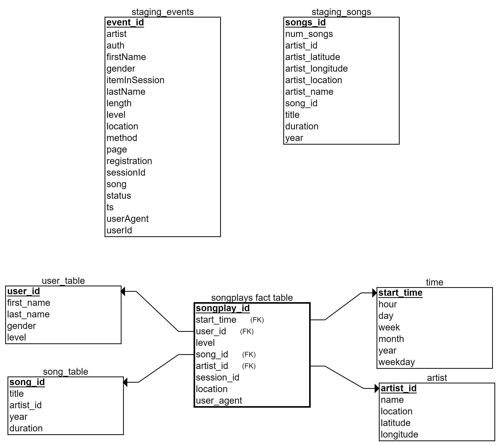

# 
 Sparkify's Data Warehouse Using Amazon's AWS Service 

## Intro
------
The project below is based on a startup company called Sparkify. Sparkify's user base has grown to a point where it has been
decided that their current proccesses and data need to be relocated to the cloud. The data resides in S3, in a directory of 
JSON logs on user activity on the app, as well as a directory with JSON metadata on the songs in their app. As their data engineer 
I have been tasked with the duty of building a ETL pipeline that will extract the data stored in S3, stages it in Redshift and 
transforms data into a set of dimensional tables for their analytics team to continue finding insights in what songs their users 
are listening to. Once the database and ETL pipeline are completed, I should be able to run queries given to me by the analytics 
team from Sparkify and compare my results.

## Purpose
------

The purpose of this project is to apply what I have learned about building a data warehouse using amazon's AWS service.
I am to write the schema for an analytic focus and write an ETL pipeline that moves data from two S3 buckets
to a Redshift based data warehouse hosted by Amazon's AWS service. The star schema is being used for the fact and dimension tables shown below.

## Schema
------
We will be using the star schema design for the database. This design allows for the use of individual tables to perform 
queries in specific fields or the use of JOIN statements to combine tables across the database for collective analytical
interest.

  

### Staging Events Table

**staging_events**- dataset of log files in JSON format generated by an event simulator
*event_id, artist, auth, firstName, gender, itemInSession, lastName, length, level, location, method, page, registration, sessionId, song, status, ts, userAgent, userId*

### Staging Songs Table

**staging_songs**- dataset is a subset of real data from the Million Song Dataset
*songs_id, num_songs, artist_id, artist_latitude, artist_longitude, artist_location, artist_name, song_id, title, duration, year*

### Fact Table

**songplays** - records in log data associated with song plays i.e. records with page NextSong  
*songplay_id, start_time, user_id, level, song_id, artist_id, session_id, location, user_agent*  

### Dimension Tables

**users** - users in the app  
*user_id, first_name, last_name, gender, level*  

**songs** - songs in music database  
*song_id, title, artist_id, year, duration*  

**artists** - artists in music database  
*artist_id, name, location, latitude, longitude*  

**time** - timestamps of records in songplays broken down into specific units  
*start_time, hour, day, week, month, year, weekday*

## Python Scripts And Descriptions
-------
We will be using the scripts below to gather, transform, and process the data from the S3 bucket directories provided to us 
which are found in the dwh.cfg file below.

**dwh.cfg**-contains Cluster, IAM_ROLE, and S3 data paths for the log file and song_data file. The Cluster and IAM_ROLE information must be filled in.  

**sql_queries.py**- contains all sql queries (i.e. table drop and create statements, insert statments) and is imported into the last three files above. 

**create_tables.py**- Calls the sql_queries.py script for dropping and creating tables.  
    
**etl.py**- Calls the sql_queries.py script for reading and processing information from staging_events and staging_songs S3 buckets and inserts them into the tables.  

**Complete_Schema.png**- Holds the Schema image used in the README.md file  

**README.md**-provides discussion on the project.  

## Order of Scripts

After the Role, User, and Redshift cluster have been created in AWS, run the scripts in the order listed below. 

- fill in the dwh.cfg with appropiate information  
- run the create_tables.py script  
- run the etl.py script