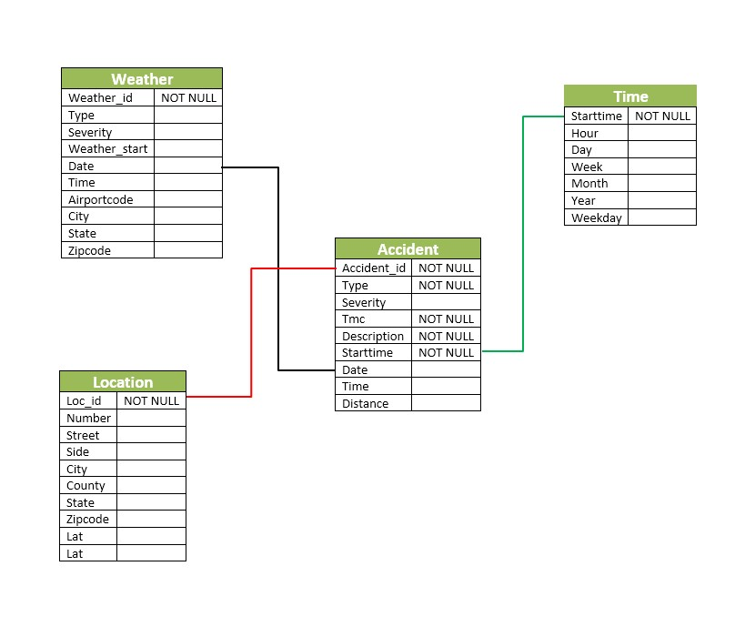
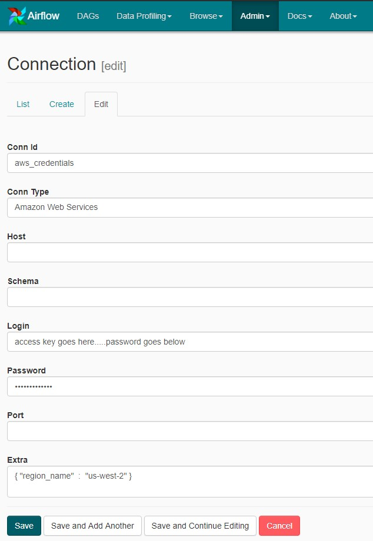
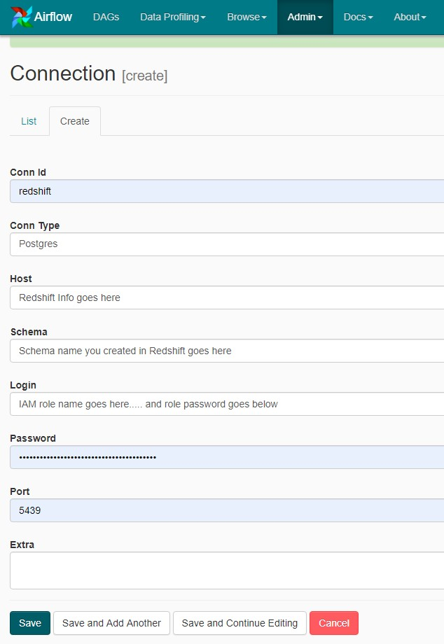
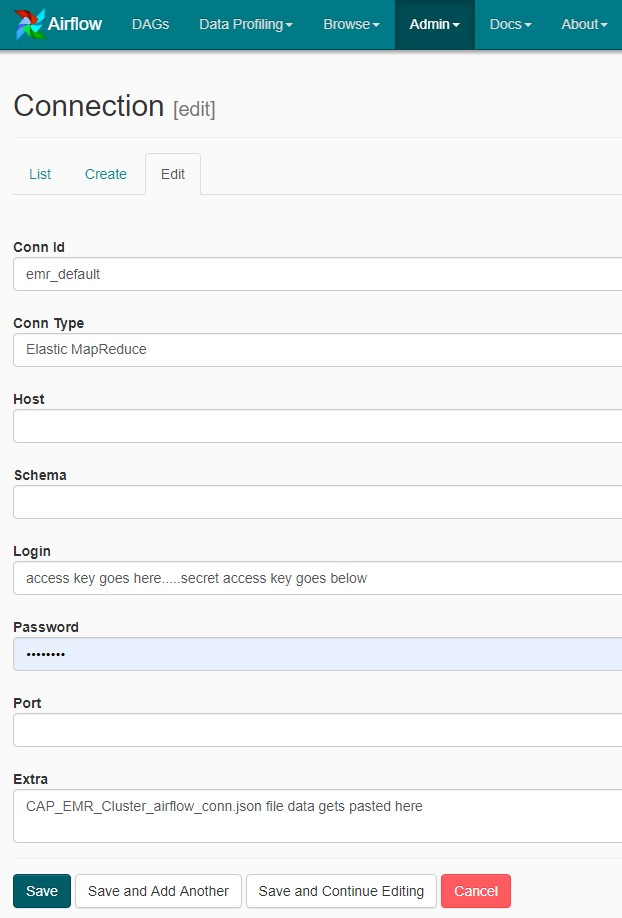

# 
 Udacity Data Engineering Capstone Project 

## Intro
------
The Data Engineering project below is based on a data gathered by Moosavi Sobhan, Mohammad Hossein Samavatian, Arnab Nandi, 
Sinivasan Parthasarathy, and Rajiv Ramnath. I will be assimilating data from two csv files containing over 25.1 million  
accidents and 4.4 million weather related events into 4 tables which can be analyzed by Data Analyst or those seeking to learn about traffic and weather patterns in the US.
The data seems to be updated once a year with the next update coming December 2020.

The data for the project can be downloaded below:  
- Download Traffic data from [here](https://osu.box.com/v/traffic-events-dec19).  

- Download Weather data from [here](https://osu.box.com/v/weather-events-dec19).  

## Purpose
------

The purpose of this project is to apply what I have learned about Data Engineering and the process of taking raw data and converting it 
into a readable format that can be analyzed and processed. The data will be pulled from Amazon's S3 service into a EMR hadoop cluster to
be processed by a Spark script which will load in the datasets, clean, and split the datasets into their appropriate tables. These newly 
created tables will then be saved as parquet files, then loaded into their respective tables in Redshift. Airflow will be orchestrating the
processes mentioned above. The reasons for choosing to handle the data in the way listed prior was to ease the memory load of my outdated pc.
The pc itself could handle the smaller of the two files, but would run out of memory handling the larger file. The EMR Cluster is scalable in
such a way that computers can be added to help with the work needed to be performed by the spark script. Another option would be to split the larger
file into smaller bits then process the data that way. The last option I could think of would be to do away with Spark, EMR, and Airflow, and go with 
Amazon's Glue and Athena service to take care of the cleaning, table creation, and querying. There are many ways to go about processing data; I just chose
what I was familiar with.

## The Data
------
### Accidents Data Descriptions  
    
|#|Attribute|	Description	|Nullable|  
|---:| :----:|:---| :----:|  
|1|	EventId|This is the identifier of a record|	No|  
|2|	Type|	The type of an event; examples are accident and congestion.	|No|  
|3|	Severity|	The severity of an event, wherever applicable. For a traffic event, severity is a number between 1 and 4, where 1 indicates the least impact on traffic (i.e., short delay as a result of the event) and 4 indicates a significant impact on traffic (i.e., long delay).|No|  
|4|	TMC|	Each traffic event has a Traffic Message Channel (TMC) code which provides a more detailed description on type of the event.|No|  
|5|	Description|	The natural language description of an event.|	No|  
|6|	StartTime (UTC)|	The start time of an event in UTC time zone.|	No|  
|7|	EndTime (UTC)|	The end time of an event in UTC time zone.|	No|  
|8|	TimeZone|	The US-based timezone based on the location of an event (eastern, central, mountain, and pacific).|	No|  
|9|	LocationLat|	The latitude in GPS coordinate.|	Yes|  
|10|	LocationLng|	The longitude in GPS coordinate.|	Yes|  
|11|	Distance (mi)|	The length of the road extent affected by the event.|	Yes|  
|12|	AirportCode|	The closest airport station to the location of a traffic event.|	Yes|  
|13|	Number|	The street number in address record.|	Yes|  
|14|	Street|	The street name in address record.|	Yes|  
|15|	Side|	The relative side of a street (R/L) in address record.|	Yes|  
|16|	City|	The city in address record.|	Yes|  
|17|	County|	The county in address record.|	Yes|  
|18|	State|	The state in address record.|	Yes|  
|19|	ZipCode|	The zipcode in address record.|	Yes|  

### Weather Data Descriptions
    
|# |Attribute|Description|Nullable|  
|---:|:----:|:---|:---:|  
|1|	EventId|	This is the identifier of a record|	No|  
|2|	Type|	The type of an event; examples are rain and snow.|	No|  
|3|	Severity|	The severity of an event, wherever applicable.|	Yes|  
|4|	StartTime (UTC)|	The start time of an event in UTC time zone.|	No|  
|5|	EndTime (UTC)|	The end time of an event in UTC time zone.|	No|  
|6|	TimeZone|	The US-based timezone based on the location of an event (eastern, central, mountain, and pacific).|	No|  
|7|	LocationLat|	The latitude in GPS coordinate.|Yes|  
|8|	LocationLng|	The longitude in GPS coordinate.|	Yes|  
|9|	AirportCode|	The airport station that a weather event is reported from.|	Yes|  
|10|City|	The city in address record.|Yes|  
|11|	County|	The county in address record.|	Yes|  
|12|	State|	The state in address record.|	Yes|  
|13|	ZipCode|	The zipcode in address record.|	Yes|  

## Schema
------
We will be using a design similar to the star schema design shown below. This design allows for the use of individual tables to perform 
queries in specific fields or the use of JOIN statements to combine tables across the database for collective analytical
interest.

  

## Data Look-in
-----
## Accidents Basic Data Look-in  

<h3>
Rows In Accidents Dataset
</h3>

 |Rows|  
 |---| 
|25119048|

<h3>
Dataset Start And End Dates
</h3>
</h3>  

| Data StartTime| Data EndTime|
|-------------------|-------------------|
|2016-08-01 00:00:00|2019-12-31 23:30:40|
 

<h3>
Unique counts
</h3>  

|IDs|states|cities|zipcodes|
|--------:|-----------:|----------:|---------:|
|25119048|         49|     16324|    29003|
  

<h3>
Top 10 Cities With Accidents Between 08-01-16 And 12-31-19
</h3>  

|       City|Accidents|
|:------------|--------------:|
|Los Angeles|   601428|
|    Houston|   519552|
|      Miami|   423794|
|   New York|   410814|
|    Chicago|   291816|
|    Atlanta|   280525|
|     Dallas|   275733|
|     Austin|   250384|
|   Brooklyn|   217729|
|    Seattle|   171611|
 

## Weather Basic Data Look-in  

<body>

<h3>
Rows in Weather Dataset
</h3> 
 
 |Rows|  
 |---|  
 |4362031|

<h3>
Dataset Start And End Dates
</h3>
  
| Data StartTime| Data EndTime|  
|-------------------|-------------------|  
|2016-08-01 00:00:00:|2019-12-31 23:47:00:|  

<h3>
Unique counts
</h3>

|IDs|States|Cities|Zipcodes|
|--------:|-----------:|----------:|---------:|
| 4362031|         48|      1714|     2017|

<h3>
Top 10 Cities With Weather Events Between 08-01-16 And 12-31-19
</h3>

|        City|Weather_Events|
|:------------|--------------:|
|Jacksonville|         17782|
|    Columbus|         17527|
|   Cleveland|         16338|
|  Greenville|         14509|
|  Washington|         14420|
|     Jackson|         13892|
|      Marion|         11722|
|     Buffalo|         11374|
|   Rochester|         11163|
|  Burlington|         11160|

### Fact Table

**accident** - records in accidents data  
*accident_id, type, severity, tmc, description, starttime, date, time, distance*  

### Dimension Tables

**weather** - weather data combined with accidents data on date (1 to 1 data matching not available)    
*weather_id, type, severity, weather_start, date, time, airportcode, city, state, zipcode*  

**location** - location information based on accident id   
*loc_id, number, street, side, city, county, state, zipcode, lat, long*  

**time** - timestamps of records in accidents broken down into specific units  
*start_time, hour, day, week, month, year, weekday*

## Scripts And Descriptions
-------
We will be using the scripts below to gather, transform, and process the data from the S3 bucket directories provided to us 
which are found in the dl.cfg file below.

**CAP_Dag.py** - Airflow Dag script for EMR cluster creation/teardown, Redshift table Creation, Data Transfer from S3 to Redshift
    
**CAP_Create_tables.sql** - Deletes existing tables and creates new tables in Amazon Redshift
    
**CAP_Spark_Wrangling.py** - Contains code for processing weather data, accident data, initiating a spark session, and placing data into tables to prep for Amazon Redshift. 
    
**CAP_EMR_Cluster_airflow_conn.json** - EMR Cluster configuration file to copied and pasted into Airflow EMR Default Config connection
 
**CAP_S3toRedshift.py** - Script to copy S3 parquet files to Redshift

**Cap_Schema.jpg**- Holds the Schema image used in the README.md file  

**README.md**-provides discussion on the project.  

    
## How To Use The Scripts (Assuming You Have Access To AWS)
- Copy/Download Traffic and Accident data to Amazon S3 Bucket(bucket example *s3://bucket_name_here/input/* create an output and scripts folder as well) 
- Copy/Download CAP_Spark_Wrangling.py to the *s3://bucket_name_here/scripts/* folder
- Setup Amazon Redshift Cluster then once it starts up, copy the IAM ARN info and cluster Endpoint info under cluster properties tab
- Setup Airflow on computer and download CAP_Dag.py, CAP_Create_tables.sql, and CAP_S3toRedshift.py in the following schema  
    
    airflow  
    |                 
    └---dags   
    |----|CAP_Dag.py  
    |----|CAP_Create_tables.sql   
    |  
    └---plugins   
        │  
        └───operators
        |    |CAP_S3toRedshift.py  
        |    |__init__.py
        |  
        |----|__init__.py
- Open the CAP_Dag.py script and fill out the variables near the top with S3 bucket input, output, scripts folder location, and Redshift IAM Role info. Example below:  
    
    1. IAM_ROLE='arn:aws:iam::123456789012:role/iam-role'
    2. INPUT = 's3a://bucket_name_here/input/'
    3. OUTPUT ='s3a://bucket_name_here/output/'
    4. SCRIPTS = 's3://bucket_name_here/scripts/'
    5. S3_BUCKET = 'bucket_name_here/output'
    
- Launch Airflow and access user interface  
- Access connections and create a new aws_credentials connection (*region name can be changed according to region you choose to use for redshift*) and redshift connection like the images below:  
    
  

    
  

  

    
  

    
-Next edit the EMR_Default connection by copying the json data in the CAP_EMR_Cluster_airflow_conn.json file and overwriting the info in the 'extra' space.
 
  

    
  

    
-Finally you go to the Dags page and turn Capstone_dag on and let it run until completion
-Once the dag has finished running, you can access the tables in Redshift to begin querying the data
    

